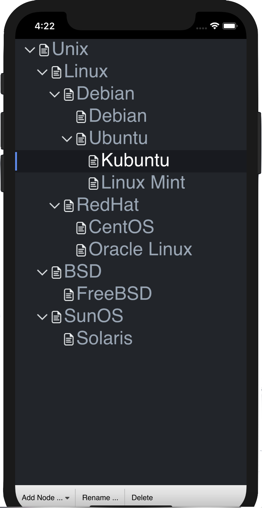

# QmlTreeWidget

## Introduction to QmlTreeWidget

*QmlTreeWidget* is an open-source QML component, which provide convenient interfaces and customizable stylesheet, and also available for iOS and Android. Since Qt 5.5, Qt provides a component called TreeView for displaying tree hierarchy. However, TreeView is only available for desktop platform, and provides inconvenient interfaces. *QmlTreeWidget* imitates the interfaces of QTreeWidget, providing *TreeItem* to help developers operate on each node in the tree. With *QmlTreeWidget*, developers could add/remove/update tree nodes flexibly and dynamically through Javascript code. Also, the customizable palette of *QmlTreeWidget* is available to developers.



## Contribution and Improvement

*QmlTreeWidget* is an open-source QML component released on Github community, thus, we encourage developers interested in this project to help us improve *QmlTreeWidget*. We would appreciate your suggestions and implementation code.
[Contact us](mailto:wangpeihao@gmail.com) to let us know your ideas.

## Download and Import QmlTreeWidget

*QmlTreeWidget* refers to a QML component for displaying tree hierarchy. It contains the source code files *TreeWidget.qml* and *TreeItem.js*, as well as the resource files *btn_expand.png*, *btn_expand@2x.png*(for high Dpi display), *btn_collapse.png*, *btn_collapse@2x.png*(for high Dpi display). You can use the following command to clone *QmlTreeWidget* to your local.

```
git clone git@github.com:peihaowang/QmlTreeWidget.git
```

Also, *QmlTreeWidget* provides an example project, which is aimed to help you know how to use *QmlTreeWidget* component. Check folder *example* for details.

For development usage, you may need to copy the source code files and the resource files to your project directory, then you can import and use *QmlTreeWidget* in your own project.

**Note that, it is not recommended to import *TreeItem.js* to your own QML files, you should only use the interfaces provided by *QmlTreeWidget*.**

You may need to learn about [Qt Framework](http://doc.qt.io/qt-5/), [Qt Quick](http://doc.qt.io/qt-5/qtquick-index.html) and [Qt Creator](http://doc.qt.io/qtcreator/index.html) before you get started to *QmlTreeWidget*.

**Note that, although the name of repository and project is *QmlTreeWidget*, but the component inside is named *TreeWidget*, thus, you should use *TreeWidget* as the component name in your own project, instead of *QmlTreeWidget*.**


## How to Use *QmlTreeWidget*

### Initialize *TreeWidget*

After you clone and import *TreeWidget* into your own project directory, you can create a tree view through the following code:

```
TreeWidget{
    id: tree
    anchors.fill: parent

    Component.onCompleted: {
        // Initialization code
    }
}
```

You can customize the icon size and the font for your own tree view through the following code:

```
TreeWidget{
    id: tree
    anchors.fill: parent

    Component.onCompleted: {
        tree.iconSize = (Qt.size(12, 12));
        tree.font.family: "Monaco";
        tree.font.pointSize: 16;
        // ...
    }
}
```

 See the *example* for details.

### Create Tree Hierarchy

To initialize *TreeWidget*, you could create items through *createItem(text, icon, parent)* method, and add nodes to the root node through *addTopLevelItem(item)* method:

```
TreeWidget{
    id: tree
    anchors.fill: parent

    Component.onCompleted: {
        tree.iconSize = (Qt.size(12, 12));
        tree.font.family = "Monaco";
        tree.font.pointSize = 16;

        tree.addTopLevelItem(tree.createItem("Item 2"));
        tree.addTopLevelItem(tree.createItem("Item 2"));
        tree.addTopLevelItem(tree.createItem("Item 3"));
    }
}
```

*createItem(text, icon, parent)* will return a newly created tree node, and you can add child nodes to it to create tree hierarchy through *appendChild(item)* method:

```
TreeWidget{
    id: tree
    anchors.fill: parent

    Component.onCompleted: {
        iconSize = (Qt.size(12, 12));
        font.family = "Monaco";
        font.pointSize = 16;

        var topItem1 = tree.createItem("Item 1");
        topItem1.appendChild(tree.createItem("Child 1"));
        topItem1.appendChild(tree.createItem("Child 2"));
        topItem1.appendChild(tree.createItem("Child 3"));
        tree.addTopLevelItem(topItem1);

        tree.addTopLevelItem(tree.createItem("Item 2"));
        tree.addTopLevelItem(tree.createItem("Item 3"));
    }
}
```

Also, *takeTopLevelItem(item)* and *removeChild(item)* is provided to remove the node from the tree.

### Update and Operate on *TreeItem*

*TreeWidget* provides *topLevelItem(index)* to get the top-level tree node through the *index* and *getCurrentItem()* method to get the currently selected node.

For each tree node, you can call *childItem(index)* to get its child node through the *index*, and call *parent* to its parent node.

**Note that: top-level nodes also have their parent node, called *root node*, which is different from the *QTreeWidget*.**

After getting a tree node, you call *setText(text)*, *setIcon(source)*, etc. methods to modify the *TreeItem* display attributes:

```
TreeWidget{
    id: tree
    anchors.fill: parent

    Component.onCompleted: {
        iconSize = (Qt.size(12, 12));
        font.family = "Monaco";
        font.pointSize = 16;

        var topItem1 = tree.createItem("Item 1");
        topItem1.appendChild(tree.createItem("Child 1"));
        topItem1.appendChild(tree.createItem("Child 2"));
        topItem1.appendChild(tree.createItem("Child 3"));
        tree.addTopLevelItem(topItem1);

        tree.addTopLevelItem(tree.createItem("Item 2"));
        tree.addTopLevelItem(tree.createItem("Item 3"));
    }
}

Button{
    id: buttonRename
    text: "Rename"

    anchors.left: parent.left;
    anchors.bottom: parent.bottom;

    onClicked: {
        var curItem = tree.getCurrentItem();
        if(curItem){
            curItem.setText("New Name");
        }
    }
}
```

### Customize Palette

Open *TreeWidget.qml*, and you will find there is a property list at the beginning.

```
// The size of tree node icon. By default, this property has a value of Qt.size(14, 14).
property size iconSize: Qt.size(14, 14)
// The font of tree node text. By default, this property has a value of Qt.font({family:"Monaco", pointSize:16}).
property font font: Qt.font({family:"Monaco", pointSize:16})

// Stylesheet
// The backgroud color of the whole tree view panel. By default, this color is set to black
readonly property color backgroundFill: Qt.rgba(33/255, 37/255, 43/255)
// The background color of tree nodes. By default, this color is set to transparent(which means showing the background of the tree view).
readonly property color backgroundNormal: Qt.rgba(0.0, 0.0, 0.0, 0.0)
// The foreground color of tree node text. By default, this color is set to pale.
readonly property color foregroundNormal: Qt.rgba(151/255, 165/255, 180/255)
// The background color of hovered tree nodes. By default, this color is set to dark black.
readonly property color backgroundHovered: Qt.rgba(44/255, 49/255, 58/255)
// The foreground color of hovered tree node text. By default, this color is set to white.
readonly property color foregroundHovered: Qt.rgba(1.0, 1.0, 1.0)   // white
// The background color of the current tree node. By default, this color is set to dark black.
readonly property color backgroundCurrent: Qt.rgba(24/255, 26/255, 31/255)
// The foreground color of the current tree node text. By default, this color is set to white.
readonly property color foregroundCurrent: Qt.rgba(1.0, 1.0, 1.0)   // white
// The color of the flag which indicates the selected nodes. By default, this color is set to steel blue.
readonly property color selectionFlagColor: Qt.rgba(86/255, 138/255, 242/255)

// The uri of expand icon resource. Or put the default icon resource into the directory same with TreeWidget.qml and use the default icon "btn_expand.png".
readonly property string uriExpandIcon: "btn_expand.png"
// The uri of collapse icon resource. Or put the default icon resource into the directory same with TreeWidget.qml and use the default icon "btn_collapse.png".
readonly property string uriCollapseIcon: "btn_collapse.png"
```

Follow the instructions of comments, and set properties to customize your own style.

Furthermore, you can also modify the source code of *TreeWidget.qml* and *TreeItem.js* to extend more functions or customize your own style, after you get familiar to the working mechanism of *TreeWidget.qml* and *TreeItem.js*.

## Support

[Email to us](mailto:wangpeihao@gmail.com) for bug report and technical support.

## Reference

We referred to a project on CODE PROJECT to create the recursive tree model. We encapsulated the commonly used methods, polished the user interface, enhanced its performance, and also made it customizable.

https://www.codeproject.com/Articles/632795/QML-TreeModel-and-TreeView

## Acknowledgement

1. [Wjj Software](http://www.wjjsoft.com).
2. [The Qt Company Ltd.](http://www.qt.io/).
3. [ShanghaiTech University](http://www.shanghaitech.edu.cn/).
4. [Icons8](https://icons8.com)
